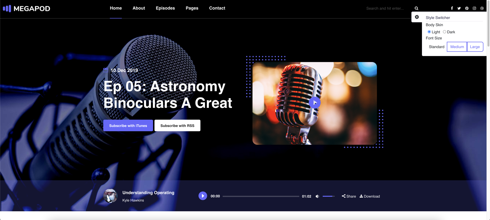
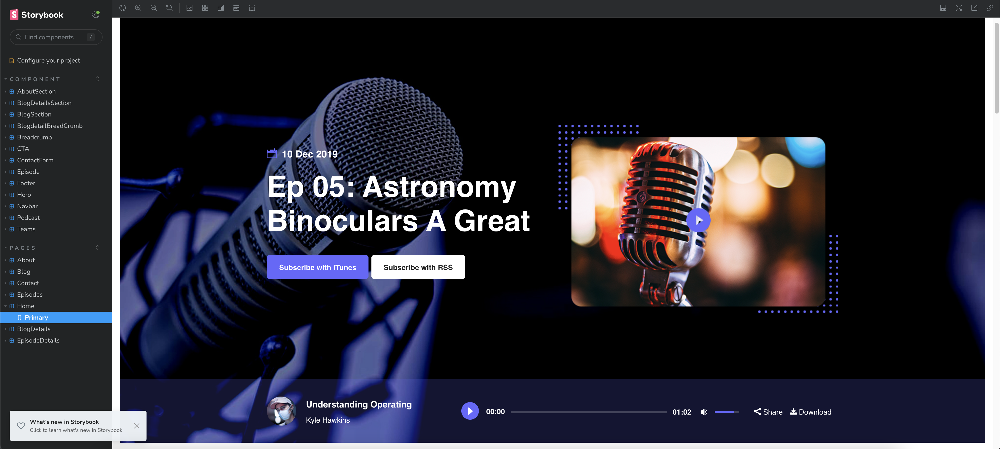

# Megapod Storybook React

Welcome `Megapod Storybook React`, a dynamic web application built using `ReactJS` and an array of modern technologies. This project offers a rich user experience with a focus on two main sections: a `blog` and an `episode` player for podcasts.

- 
- 
- 
- 
- 
- 
- 
- 
- 
- 
- 
- 

## Table of Contents

- [Getting Started](#getting-started)
  - [Prerequisites](#prerequisites)
  - [Installation](#installation)
- [Technologies Used](#technologies-used)
- [Pages](#pages)
- [Screenshots](#screenshots)
- [License](#license)

## Getting Started

Follow these steps to get your project up and running on your local machine.

### Prerequisites

Make sure you have the following software installed on your computer:

- **Node.js:** Download and install Node.js from the official website: [Node.js Downloads](https://nodejs.org/)

To check if Node.js is installed, open your terminal or command prompt and run:

```bash
node -v
```

- **Yarn (optional):** Although npm (Node Package Manager) comes bundled with Node.js, we recommend using Yarn as your package manager. Install Yarn globally by following the instructions here: [Yarn Installation](https://classic.yarnpkg.com/en/docs/install/)

or

Check if npm is installed using

```
npm -v
```

#### Then,

Run Command to install yarn on Linux/Mac

```
sudo npm i -g yarn
```

Windows

```
npm install --global yarn
```

### Installation

Step-by-step instructions on how to install and run your project locally.

#### Clone the repository

```
git clone https://github.com/HamzaAshfaq01/MegaPod-React-Storybook.git
```

#### Navigate to the project directory

```
cd MegaPod-React-Storybook
```

#### Install dependencies

```
yarn add
```

#### Start the development server

```
yarn start
```

### Running StoryBook

Step-by-step instructions on how to install and run your project locally.

#### Navigate to the project directory

```
cd MegaPod-React-Storybook
```

#### Start the storybook server

```
yarn storybook
```

## Technologies Used

- ReactJS
- Sass
- Bootstrap
- Node.js
- Yarn
- ESLint
- Redux Toolkit
- JSX
- jQuery
- JPlayer
- React Router v6
- Storybook

## Pages

- Home Page
- About Page
- Blog Page
- Single Blog Page
- Episode Page
- Single Episode Page
- Contact Page

## Screenshots

### Application



### Storybook



## License

MIT License
